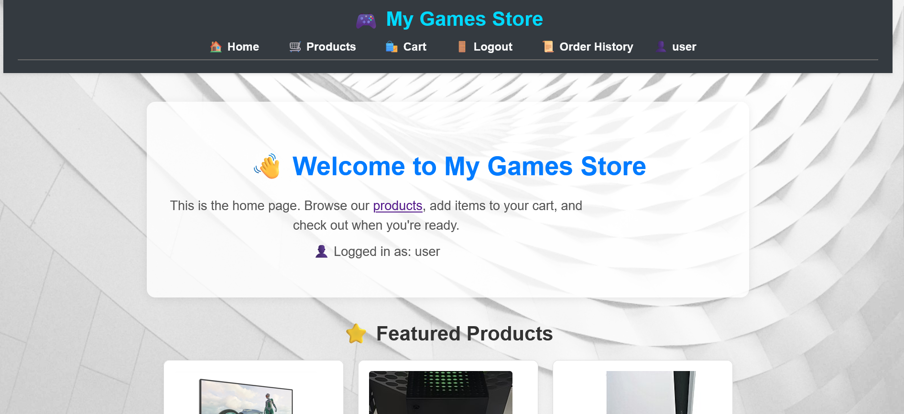
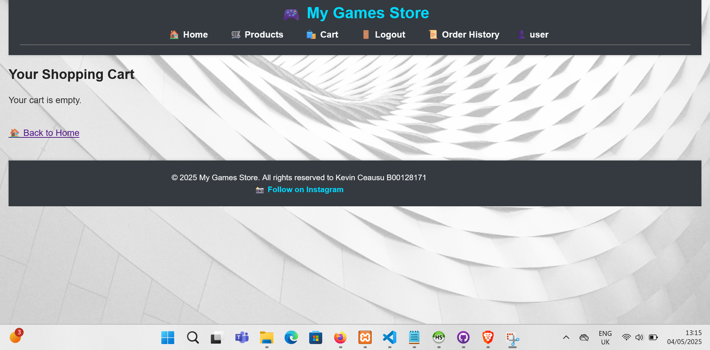
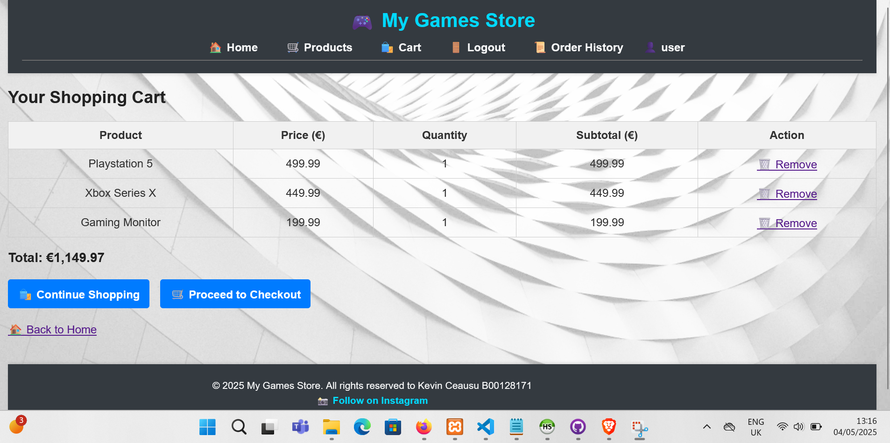
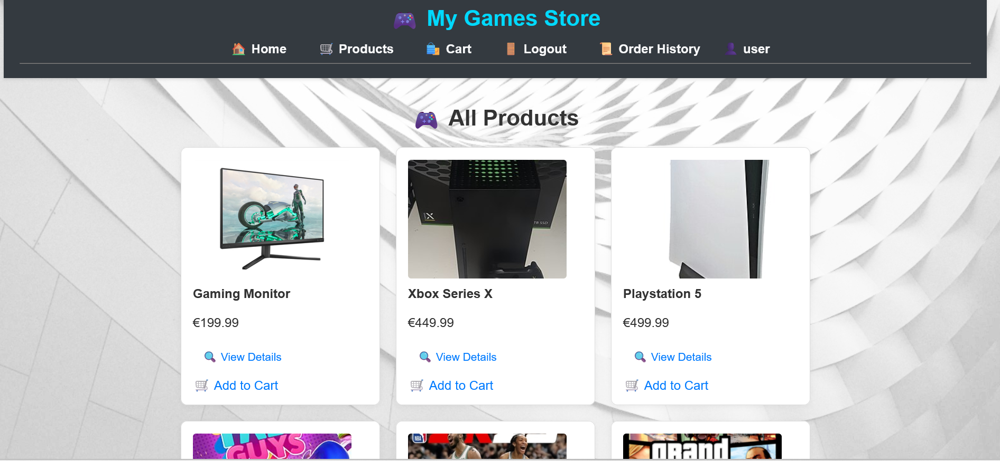
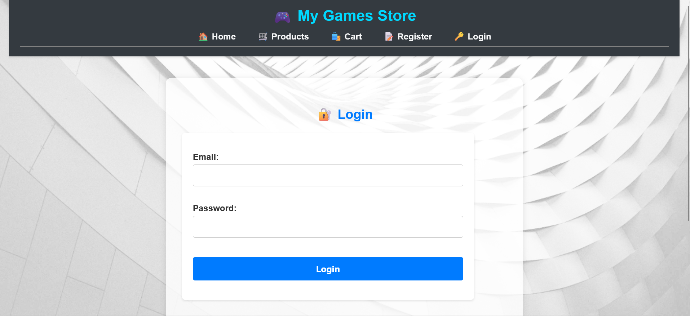
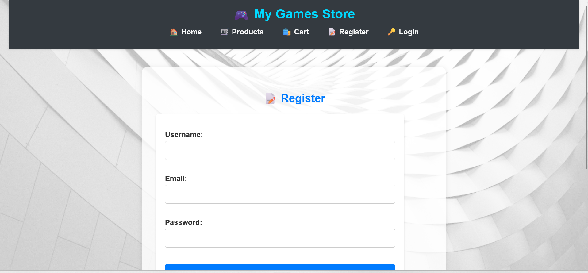

No reference or specifc tutorials were used for the project.
My contribution, Kevin Ceausu B00128171 is 100% to the project.


---

## Requirements

- PHP
- MySQL (HeidiSQL)
- Apache (use XAMPP or similar)

---

## Setup Instructions

1. **download this repo**

2. **Import the database**  
   - Open [HeidiSQL]
   - Create a new database named `store_db`
   - Right-click the DB → "Execute SQL file..." → select `database/store_db.sql`

3. **Update database config**  
   - Open `app/config.php`  
   - Set your DB credentials:

     ```php
     define('DB_HOST', 'localhost');
     define('DB_NAME', 'store_db');
     define('DB_USER', 'root');
     define('DB_PASS', '');
     ```

4. **Run the site**  
   - Place the project in `htdocs/` (XAMPP)
   - Open your browser:  
     `http://localhost/store_project/public/index.php`

---

##  Admin Access

In your `users` table, manually set `is_admin = 1` for any user to grant admin privileges.

---

## Screenshots

### Home Page


### Cart Page


###  Cart with Products


### Products


### Login


### Register


---

##  Author

Kevin Ceausu  
Student ID: B00128171

##  Testing

Basic unit and manual testing was performed for:

- Database connection 
- Cart total calculation
- Admin-only access to protected pages
- Stock update after checkout
- Authentication logic


